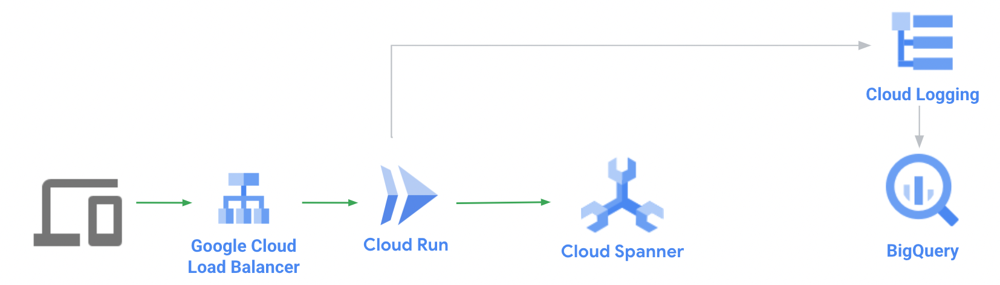
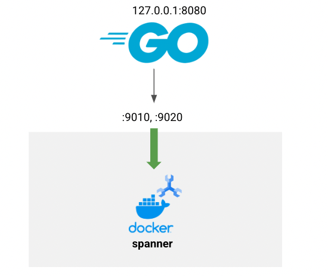

# README
## Short version in Japanese is [here](README.ja-short.md).

## Contents.
- Local Development
- Deploy to production
- Transfer logging to Google BigQuery
- **Appendix**: Attach Google Cloud Load Balancer with Google Managed SSL certificate



## Let's get started with some preparation.
1. Sign in to your project.
```
gcloud auth login
gcloud auth application-default login
```
2. Install spanner-cli.  
If you don't have 'go' yet, you need to install the latest one.  
https://go.dev/doc/install
```
go install github.com/cloudspannerecosystem/spanner-cli@latest
export PATH=$PATH:~/go/bin
```
3. Set your environment variables.
```
export GOOGLE_CLOUD_PROJECT=<your-project>
```

Save the value just in case when switching environment.
```
export PRODUCTION_PROJECT=$GOOGLE_CLOUD_PROJECT
```

4. Clone this code to your local.
```
git clone https://github.com/shin5ok/egg6-architecting
```

## Local development



1. Prepare for local development.

If you don't have profile for local, run it.
```
gcloud config configurations create local-dev
```

Set some config values for Cloud Spanner emulator.
```
gcloud config set auth/disable_credentials true
gcloud config set project your-project-id
gcloud config set api_endpoint_overrides/spanner http://localhost:9020/
```

2. Run Cloud Spanner emulator.
```
docker compose up -d spanner
```
- See here to understand the limitation of Cloud Spanner emulator.  
https://cloud.google.com/spanner/docs/emulator?hl=ja#limitations_and_differences
- Notice: You might use old 'docker-compose' or 'docker'.  
Check if the version support some features we use.

4. Set environment variable for the Cloud Spanner emulator.
```
export SPANNER_EMULATOR_HOST=localhost:9010
export GOOGLE_CLOUD_PROJECT=your-project-id
```
It will make API calls of Spanner direct to local emulator.

5. Create a Cloud Spanner instance in local emulator.
```
gcloud spanner instances create test-instance \
   --config=emulator-config --description="test Instance" --nodes=1
```
6. Create database and migrate schemas with sample data.  
Make sure that you are where the repository was cloned to.
```
cd your-cloned-directory/
```

Prepare database.
```
gcloud spanner databases create --instance test-instance game
```
Additionally create schemas and initial data.
```
for schema in ./schemas/*.sql;
do
    spanner-cli -p $GOOGLE_CLOUD_PROJECT -i test-instance -d game < $schema
done
```


7. Make sure if the emulator works on local environment.  
Login to the emulator.
```
spanner-cli -i test-instance -p $GOOGLE_CLOUD_PROJECT -d game
```
Run some command to see how it works, like,
```
show tables;
show create table users;
show create table users_items;
show create table items;
select * from items;
```

8. Test it as local app.
Run it locally.
```
export SPANNER_STRING=projects/$GOOGLE_CLOUD_PROJECT/instances/test-instance/databases/game
PORT=8080 go run .
```
9. Test it.
- Check if the api server is alive
```
curl http://localhost:8080/ping
```
- Create a user
```
curl http://localhost:8080/api/user/foo -X POST
```
Note the id that you found in response.  
The id might be like 516c3e80-5c15-11ed-8506-071d4abd8d4a.
- Add an item to the user
```
USER_ID=<your user id>
ITEM_ID=d169f397-ba3f-413b-bc3c-a465576ef06e
curl http://localhost:8080/api/user_id/$USER_ID/$ITEM_ID -X PUT
```

- Get all items that belongs to the user
```
curl http://localhost:8080/api/user_id/$USER_ID -X GET
```

- Run test it totally
```
go test -v
```

## Deploy the app to Google Cloud

1. Switch profile to Production project.
```
gcloud config configurations create egg6-3
gcloud config set project $PRODUCTION_PROJECT
```
Run this command in your shell, just in case.
```
export GOOGLE_CLOUD_PROJECT=$PRODUCTION_PROJECT
export SPANNER_STRING=projects/$GOOGLE_CLOUD_PROJECT/instances/test-instance/databases/game
unset SPANNER_EMULATOR_HOST
```

2. Enable services you will use.
```
gcloud services enable \
spanner.googleapis.com \
run.googleapis.com \
cloudbuild.googleapis.com \
artifactregistry.googleapis.com
```

3. Create a service account for Cloud Run service.
```
gcloud iam service-accounts create game-api
```
Add iam policy to access Cloud Spanner instances in your project.
```
export SA=game-api@$GOOGLE_CLOUD_PROJECT.iam.gserviceaccount.com
gcloud projects add-iam-policy-binding $GOOGLE_CLOUD_PROJECT --member=serviceAccount:$SA --role=roles/spanner.databaseUser
```

4. Create a spanner instance for production.
```
gcloud spanner instances create --nodes=1 test-instance --description="for production" --config=regional-asia-northeast1
```

5. Create database, schema etc.  
Run some command as below,

5-1. Prepare database.
```
gcloud spanner databases create --instance test-instance game
```
5-2. Additionally create schemas and initial data.
```
for schema in ./schemas/*.sql;
do
    spanner-cli -p $GOOGLE_CLOUD_PROJECT -i test-instance -d game < $schema
done
```

5-3. You can use spanner-cli to confirm schema and data in the Cloud Spanner instance.
```
spanner-cli -i test-instance -p $GOOGLE_CLOUD_PROJECT -d game
```

6. Deploy a Cloud Run service.
- Option1: With buildpacks
```
gcloud run deploy game-api --allow-unauthenticated --region=asia-northeast1 \
--set-env-vars=SPANNER_STRING=$SPANNER_STRING \
--service-account=$SA --source=.
```
- Option2: With Dockerfile as the general way  
  Create a repo on Artifact Registory and grant push on local env.  
```
gcloud artifacts repositories create my-app --repository-format=docker --location=asia-northeast1
gcloud auth configure-docker asia-northeast1-docker.pkg.dev
```
  Build a container.
```
IMAGE=asia-northeast1-docker.pkg.dev/$GOOGLE_CLOUD_PROJECT/my-app/game-api
docker build -t game-api -f Dockerfile.option2 .
docker tag game-api $IMAGE
docker push $IMAGE
```
  Deploy it to Cloud Run service.
```
gcloud run deploy game-api --allow-unauthenticated --region=asia-northeast1 \
--set-env-vars=SPANNER_STRING=$SPANNER_STRING \
--service-account=$SA --image $IMAGE
```

7. Congratulation!!  
Just test it, like on local.  
Of course you need to specify the actual url instead of "http://localhost:8080".  
The url the Cloud Run service was assigned to would be like this "https://game-api-xxxxxxxxx-xx.a.run.app".


## Transfer logging to Google BigQuery

1. Create dataset as the destination of log.
```
bq mk --location asia-northeast1 dataset1
```

2. Create a Log Sink for BigQuery.
```
gcloud logging sinks create game-api-sink \
bigquery.googleapis.com/projects/$GOOGLE_CLOUD_PROJECT/datasets/dataset1 \
--description="for Cloud Run service 'game-api'" \
--log-filter='resource.type="cloud_run_revision" AND resource.labels.configuration_name="game-api" AND jsonPayload.message!=""'
```

3. Grant permission for BigQuery dataEditor to the service account.
```
LOGSA=$(gcloud logging sinks describe game-api-sink --format=json | jq .writerIdentity -r)

gcloud projects add-iam-policy-binding $PROJECT_ID --member=$LOGSA --role=roles/bigquery.dataEditor
```

That's all, you can access the api and you will see all logs in BigQuery tables.  
Maybe you need to wait for a few minutes at the first time until Log Sink started.

## **Appendix**: Attach Google Cloud Load Balancer with Google Managed SSL certificate
### Note: requirement to pass the step.
Need to prepare a domain zone that you have authorization of because it's going to use your custom domain.

1. Reserve your external IP address.
```
gcloud compute addresses create game-api-ip \
    --network-tier=PREMIUM \
    --ip-version=IPV4 \
    --global
```

2. Create a Serverless NEG.
```
gcloud compute network-endpoint-groups create game-api \
    --region=asia-northeast1 \
    --network-endpoint-type=serverless  \
    --cloud-run-service=game-api
```

3. Create a Backend service. 
```
gcloud compute backend-services create backend-for-game-api \
    --load-balancing-scheme=EXTERNAL \
    --global
```
And register the Serverless NEG to it.
```
gcloud compute backend-services add-backend backend-for-game-api \
    --global \
    --network-endpoint-group=game-api \
    --network-endpoint-group-region=asia-northeast1
```

4. Create a Urlmap.
```
gcloud compute url-maps create urlmap-for-game-api \
   --default-service backend-for-game-api
```

5. Create a Google managed SSL Certificate.
```
FQDN=<your FQDN you want to use>
gcloud compute ssl-certificates create ssl-cert-for-game-api \
   --domains $FQDN
```

6. Create a Target Proxy.
```
gcloud compute target-https-proxies create target-proxy-for-game-api \
   --ssl-certificates=ssl-cert-for-game-api \
   --url-map=urlmap-for-game-api
```
7. Configure a forwarding rule to game-api.
```
gcloud compute forwarding-rules create forwarding-to-game-api \
    --load-balancing-scheme=EXTERNAL \
    --network-tier=PREMIUM \
    --address=game-api-ip \
    --target-https-proxy=target-proxy-for-game-api \
    --global \
    --ports=443
```

8. Update DNS record.  
Find the IP address your Load Balancer uses.
```
gcloud compute addresses describe game-api-ip --global --format=json | jq .address -r
```
You need to register this IP address corresponding to your FQDN record to your DNS zone.  
It depends on the way to manage your DNS.  

If you use Cloud DNS, you can create your managed zone and a record corresponding to this IP address.
like this,
```
gcloud dns managed-zones create <your-zone-name> --dns-name=<your-domain-name> --description="My Domain"
gcloud dns record-sets create --type=A --zone=<your-zone-name> --rrdatas=<IP address> $FQDN
```
Make sure that you register the NS records corresponding to your domain to authoritative DNS.
You will get the NS records by this command,
```
gcloud dns managed-zones describe <your-zone-name> --format=json | jq -r .nameServers[]
```

It also take a while to become to active the certification.  
You might see 4xx/5xx response or SSL error until that.
