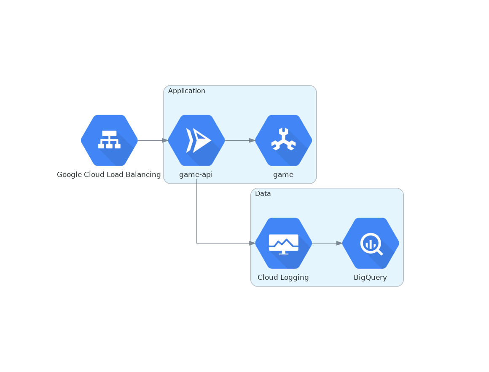
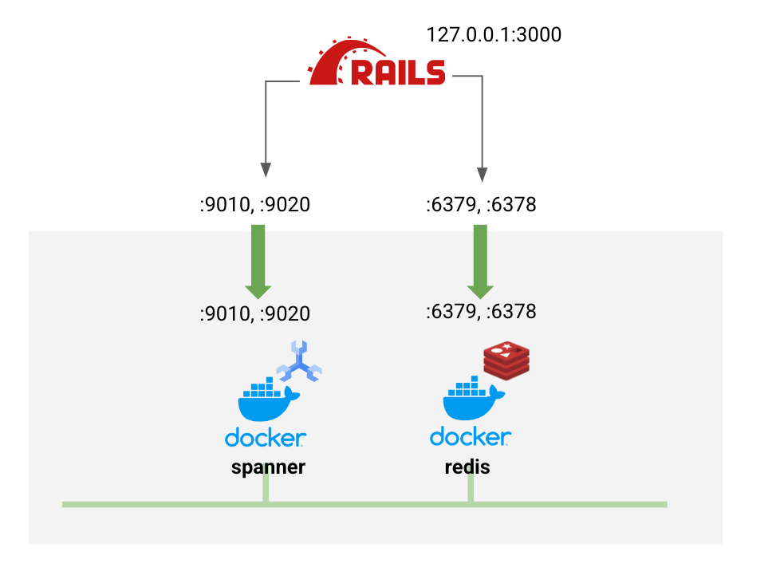
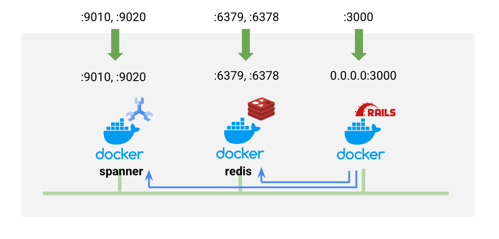

# README

## Contents.
- Local Development
- Dockernize Go application
- Deploy to production
- Transfer logging to Google BigQuery
- Appendix: Attach Google Cloud Load Balancer with Google Managed SSL certificate
- Appendix: Terraform code to build infrastructure



## Let's get started with some preparation.
1. Sign in to your project.
```
gcloud auth login
gcloud auth application-default login
```
2. Install spanner-cli
```
go install github.com/cloudspannerecosystem/spanner-cli@latest
export PATH=$PATH:~/go/bin
```
3. Set your environment
```
export GOOGLE_CLOUD_PROJECT=<your-project>
```

4. Clone this code.
```
git clone https://github.com/shin5ok/egg6-architecting
```

## Local development



1. Install Ruby 3.1.2 or higher.  
Consider using rbenv.  
You might need some utilities like Bundler.

2. Prepare for local development.

If you don't have profile for local, run it.
```
gcloud config configuration create local-dev
```

Set some config values for Cloud Spanner emulator.
```
gcloud config set auth/disable_credentials true
gcloud config set project your-project-id
gcloud config set api_endpoint_overrides/spanner http://localhost:9020/
```

3. Run Cloud Spanner emulator and Redis.
```
docker compose up -d spanner redis
```
- See here to understand the limitation of Cloud Spanner emulator.  
https://cloud.google.com/spanner/docs/emulator?hl=ja#limitations_and_differences
- Notice: You might use old 'docker-compose' or 'docker'.  
Check if the version support some features we use.

4. Set environment variable for the Cloud Spanner emulator.
```
PRODUCTION_PROJECT=$GOOGLE_CLOUD_PROJECT
export SPANNER_EMULATOR_HOST=localhost:9010
export GOOGLE_CLOUD_PROJECT=your-project-id
```
It wll make API calls of Spanner direct to local emulator.

5. Create a Cloud Spanner instance in local emulator.
```
gcloud spanner instances create test-instance \
   --config=emulator-config --description="test Instance" --nodes=1
```
6. Create database and migrate schemas with sample data.  
Make sure that you are where the repository was cloned to.
```
cd your-cloned-directory/
```

Install libraries.
```
bundle install
```

Prepare databases.
```
./bin/rails db:create 
./bin/rails db:migrate
./bin/rails db:seed
```

7. Make sure if the emulator works on local environment.
Login to the emulator.
```
spanner-cli -i test-instance -p $GOOGLE_CLOUD_PROJECT -d users
```
Run some command to see how it works, like,
```
show tables;
show create table users;
select * from users;
```
You can also confirm records through 'rails console'.

8. Test it as local app.
Make sure environment variables you set before are existed.
```
env
```
If you want to use query result cache with Redis, set REDIS_HOST
```
export REDIS_HOST=127.0.0.1
./bin/rails s
```
Just test it, like this
```
curl localhost:3000/users
curl localhost:3000/users/a909063e-2c25-11ed-9d6d-2bd2e05a2640
curl -H "Content-Type: application/json" -X POST localhost:3000/users -d '{"name":"foo","address":"Japan","score":100}'
curl -X DELETE localhost:3000/users/a909063e-2c25-11ed-9d6d-2bd2e05a2640
```

## Dockernize Rails7 application



9. Build a docker container for production.
```
docker build -t user-api .
```

10. Run the docker container with enabling cache.  
Connecting it to the network that was prepared for Redis container previously would be important.
```
docker run -it -p 3000:3000 -e REDIS_HOST=redis -e SPANNER_EMULATOR_HOST=spanner:9010 -e RAILS_MASTER_KEY=$(cat ./config/master.key) -e GOOGLE_CLOUD_PROJECT=$GOOGLE_CLOUD_PROJECT --network=user_api_network user-api
```
And then, test it.  
When you want to terminate it, just Ctrl + C.

11. Completion as local development, the app looks like working well.


## [Option] If you use VSCode, you can consider Cloud Code for Cloud Run.  
It provides you with local development environments.  
See [link](https://cloud.google.com/code/docs/vscode/develop-service).


## Deploy the app to Google Cloud

1. Switch profile to actual project from local development.
```
gcloud config configuration create rails-app
gcloud confg set project $PRODUCTION_PROJECT
```
Run this command in your shell, just in case.
```
unset SPANNER_EMULATOR_HOST
```

2. Enable services you will use.
```
gcloud services enable \
spanner.googleapis.com \
secretmanager.googleapis.com \
run.googleapis.com \
cloudbuild.googleapis.com \
artifactregistry.googleapis.com \
vpcaccess.googleapis.com \
redis.googleapis.com
```

3. Create a service account for Cloud Run service.
```
gcloud iam service-accounts create user-api
```
Add iam policy to access Cloud Spanner instances in your project.
```
export SA=user-api@$GOOGLE_CLOUD_PROJECT.iam.gserviceaccount.com
gcloud projects add-iam-policy-binding $GOOGLE_CLOUD_PROJECT --member=serviceAccount:$SA --role=roles/spanner.databaseUser
```

4. Create a secret and register data to the first one.
```
cat ./config/master.key | gcloud secrets create RAILS_MASTER_KEY --data-file=-
```

5. Create a spanner instance for production.
```
gcloud spanner instances create --nodes=1 test-instance --description="for test/production" --config=regional-asia-northeast1
```

6. Create database, schema etc.  
Run some command as below,
```
./bin/rails db:create RAILS_ENV=production
./bin/rails db:migrate RAILS_ENV=production
./bin/rails db:seed RAILS_ENV=production
```
You can use spanner-cli to confirm schema and data in the Cloud Spanner instance.
```
spanner-cli -i test-instance -p $GOOGLE_CLOUD_PROJECT -d users
```

5. Create a VPC for Redis.
```
gcloud compute networks create my-network --subnet-mode=custom
gcloud compute networks subnets create --network=my-network --region=asia-northeast1 --range=10.0.0.0/16 tokyo
```

6. Prepare a Redis host as Memotystore for Redis.
```
gcloud redis instances create test-redis --zone=asia-northeast1-b --network=my-network --region=asia-northeast1
```

7. Create a repository on Artifact Registory.
```
gcloud artifacts repositories create my-app --repository-format=docker --location=asia-northeast1
```
Set up your local docker environment to push images to/pull images from the repository.
```
gcloud auth configure-docker asia-northeast1-docker.pkg.dev
```

8. Build a docker image and push it to the repository.
```
export IMAGE=asia-northeast1-docker.pkg.dev/$GOOGLE_CLOUD_PROJECT/my-app/user-api
docker tag user-api $IMAGE
docker push $IMAGE
```

9. Configure a Serverless Access Connector.
```
gcloud compute networks vpc-access connectors create user-api-vpc-access --network my-network --region asia-northeast1 --range 10.8.0.0/28
```
Add IAM policies to service account for Cloud Run.
```
gcloud projects add-iam-policy-binding $GOOGLE_CLOUD_PROJECT --member=serviceAccount:$SA --role=roles/compute.viewer
gcloud projects add-iam-policy-binding $GOOGLE_CLOUD_PROJECT --member=serviceAccount:$SA --role=roles/vpcaccess.user
```

10. Add an IAM policy for the secret for Cloud Run.
```
gcloud secrets add-iam-policy-binding RAILS_MASTER_KEY --member=serviceAccount:$SA --role=roles/secretmanager.secretAccessor
```

11. Deploy a Cloud Run service.
```
VA=projects/$GOOGLE_CLOUD_PROJECT/locations/asia-northeast1/connectors/user-api-vpc-access
REDIS_HOST=$(gcloud redis instances describe test-redis --region=asia-northeast1 --format=json | jq .host -r)

gcloud beta run deploy user-api --allow-unauthenticated --region=asia-northeast1 \
--set-env-vars=GOOGLE_CLOUD_PROJECT=$GOOGLE_CLOUD_PROJECT,REDIS_HOST=$REDIS_HOST \
--update-secrets=RAILS_MASTER_KEY=RAILS_MASTER_KEY:latest \
--service-account=$SA --image=$IMAGE \
--vpc-connector=$VA --port=3000 \
--min-instances=2 --cpu=2 --memory=2Gi
```

12. Congratulation!!  
Just test it.


## Transfer logging to Google BigQuery

1. Create dataset as the destination of log.
```
bq mk --location asia-northeast1 dataset1
```

2. Create a Log Sink for BigQuery.
```
gcloud logging sinks create user-api-sink \
bigquery.googleapis.com/projects/$GOOGLE_CLOUD_PROJECT/datasets/dataset1 \
--description="for Cloud Run service 'user-api'" \
--log-filter='resource.type="cloud_run_revision" AND resource.labels.configuration_name="user-api" AND jsonPayload.action!=""'
```

3. Grant permission for BigQuery dataEditor to the service account.
```
LOGSA=$(gcloud logging sinks describe user-api-sink --format=json | jq .writerIdentity -r)

gcloud projects add-iam-policy-binding $PROJECT_ID --member=$LOGSA --role=roles/bigquery.dataEditor
```

That's all, you can access the api and you will see all logs in BigQuery tables.  
Maybe you need to wait for a few minutes at the first time until Log Sink started.

## Appendix: Attach Google Cloud Load Balancer with Google Managed SSL certificate

1. Reserve your external IP address.
```
gcloud compute addresses create user-api-ip \
    --network-tier=PREMIUM \
    --ip-version=IPV4 \
    --global
```

2. Create a Serverless NEG.
```
gcloud compute network-endpoint-groups create user-api \
    --region=asia-northeast1 \
    --network-endpoint-type=serverless  \
    --cloud-run-service=user-api
```

3. Create a Backend service. 
```
gcloud compute backend-services create backend-for-user-api \
    --load-balancing-scheme=EXTERNAL \
    --global
```
And register the Serverless NEG to it.
```
gcloud compute backend-services add-backend backend-for-user-api \
    --global \
    --network-endpoint-group=user-api \
    --network-endpoint-group-region=asia-northeast1
```

4. Create a Urlmap.
```
gcloud compute url-maps create urlmap-for-user-api \
   --default-service backend-for-user-api
```

5. Create a Google managed SSL Certificate.
```
FQDN=<your FQDN you want to use>
gcloud compute ssl-certificates create ssl-cert-for-user-api \
   --domains $FQDN
```

6. Create a Target Proxy.
```
gcloud compute target-https-proxies create target-proxy-for-user-api \
   --ssl-certificates=ssl-cert-for-user-api \
   --url-map=urlmap-for-user-api
```
7. Configure a forwarding rule to user-api.
```
gcloud compute forwarding-rules create forwarding-to-user-api \
    --load-balancing-scheme=EXTERNAL \
    --network-tier=PREMIUM \
    --address=user-api-ip \
    --target-https-proxy=target-proxy-for-user-api \
    --global \
    --ports=443
```

8. Update DNS record.  
Find the IP address your Load Balancer uses.
```
gcloud compute addresses describe user-api-ip --global --format=json | jq .address -r
```
You need to register this IP address corresponding to your FQDN record.  
It depends on the way to manage your DNS.


## Appendix: Terraform code to build infrastructure

### Notice:
- This code uses a demo container image GCP provided.
- The logging filter for Log Sink in this code follows to the log format that the container app put out.
- Some component names are different from above procedures.

1. Prepare terraform the latest version.
Follow this step to install/upgrade terraform.  
https://learn.hashicorp.com/tutorials/terraform/install-cli

2. [Option] Set variables before terraform execution.
```
export TF_VAR_project=<your project>
export TF_VAR_gcs=<your GCS bucket for managing state>
export TF_VAR_domain=<your domain that will be used to SSL Certification>
export TF_VAR_secret_data=<expected master.key data>
export TF_VAR_region=<your region>
export TF_VAR_zone=<your zone>
```
If you forgot to set some variables, terraform will ask you what is the value of missing ones when it was invoked.

3. Run terraform.
```
cd terraform/
terraform plan
terraform apply
```
